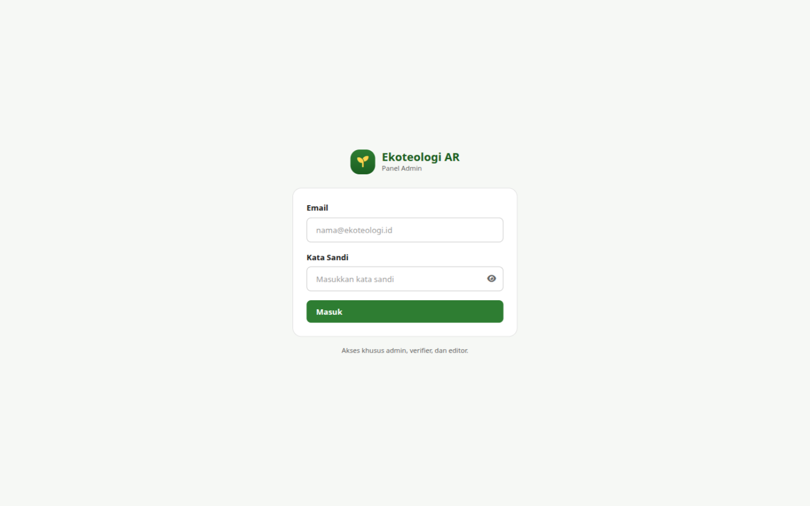

# Bab 2 — Masuk & Keluar Panel

## 2.1 Masuk (Login)

1. Buka alamat panel admin di peramban (saat pengembangan lokal:
   `http://localhost:5173`; di server tim, gunakan alamat yang diberikan PO).
2. Isi **Email** dan **Kata Sandi** akun panel Anda.
3. Klik **Masuk**.

Jika email/kata sandi benar dan akun Anda berperan admin/verifier/editor, Anda
langsung dibawa ke **Dashboard**.

Catatan:

- Tombol ikon mata di kolom kata sandi menampilkan/menyembunyikan isi kolom —
  berguna saat mengetik ulang kredensial.
- Jika Anda membuka alamat halaman tertentu tanpa sesi (mis. `…/verifikasi`),
  Anda akan diarahkan ke halaman login lalu kembali ke halaman itu setelah masuk.

## 2.2 Keluar (Logout)

1. Lihat **kartu akun** di bagian bawah sidebar kiri.
2. Klik tombol ikon panah-keluar di sisi kanan kartu.

Sesi berakhir dan Anda kembali ke halaman login. Keluar juga terjadi otomatis bila
sesi Anda kedaluwarsa dan pembaruan token gagal.

## 2.3 Mengatasi Gagal Masuk

| Gejala | Penyebab | Solusi |
|---|---|---|
| Kotak merah *"Email dan kata sandi wajib diisi."* | Ada kolom kosong | Lengkapi kedua kolom |
| Pesan error dari server saat klik Masuk | Email atau kata sandi salah | Periksa kembali; hubungi admin utama bila lupa |
| *"Akun Anda tidak memiliki akses ke panel admin."* | Akun berrole `user`, bukan role panel | Akun harus dipromosikan dari server (`create_admin`/update role) |
| *"Tidak dapat terhubung ke server. Periksa koneksi Anda."* | API tidak aktif / jaringan putus | Pastikan backend API berjalan (lokal: port 8100) lalu coba lagi |

Lanjut ke [Bab 3 — Dashboard](03-dashboard.md).
