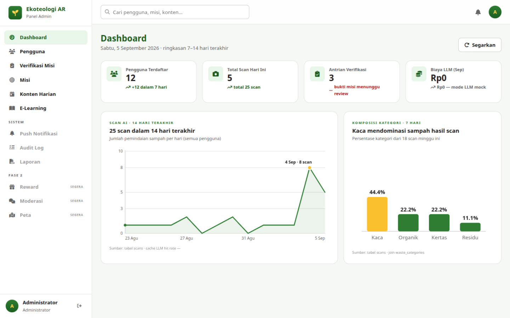

# Bab 3 — Dashboard

## 3.1 Tujuan

Dashboard adalah halaman pembuka setelah login: ringkasan kesehatan aplikasi
7–14 hari terakhir. Halaman ini **hanya-baca** — tidak ada aksi perubahan data.

**Cara akses:** menu **Dashboard** (halaman pertama setelah masuk).

## 3.2 Empat Kartu KPI

| Kartu | Artinya |
|---|---|
| **Pengguna Terdaftar** | Total akun pengguna; angka hijau di bawahnya = pertumbuhan 7 hari terakhir |
| **Total Scan Hari Ini** | Jumlah pemindaian sampah oleh seluruh pengguna hari ini; sub-teks menampilkan total keseluruhan |
| **Antrian Verifikasi** | Jumlah bukti misi yang **menunggu keputusan Anda** — berwarna merah bila > 0; segera kerjakan (Bab 5) |
| **Biaya LLM (bulan berjalan)** | Estimasi biaya pemakaian LLM bulan ini + jumlah token; bila tampil *"mode LLM mock"* berarti server memakai provider uji tanpa biaya |

## 3.3 Dua Grafik

1. **Scan AI · 14 hari terakhir** (garis) — jumlah pemindaian per hari.
   Judul kartu merangkum totalnya, dan titik aksen menandai hari puncak.
   Di kaki grafik ada catatan *cache LLM hit rate* — persentase analisis yang
   terjawab dari cache (semakin tinggi, semakin hemat biaya).
2. **Komposisi Kategori · 7 Hari** (batang) — persentase kategori sampah
   (Organik, Plastik, Kertas, Kaca, Logam, B3, Residu) dari scan minggu ini.
   Batang terbesar disorot warna emas; judul kartu menyebut kategori dominan.

Kedua grafik bergantung data nyata: bila belum ada scan, grafik menampilkan
pesan kosong (mis. *"Belum ada scan tercatat"*).

## 3.4 Kapan Perlu Membuka Dashboard?

- **Setiap awal shift/hari kerja**: periksa **Antrian Verifikasi** — bila > 0,
  langsung ke Bab 5.
- **Mingguan**: pantau tren scan & komposisi kategori sebagai bahan evaluasi misi
  (mis. kategori Plastik dominan → buat misi setor plastik).
- **Bulanan**: catat **Biaya LLM** untuk pelaporan operasional.

Tombol **Segarkan** memuat ulang semua angka tanpa membuka ulang halaman.

Lanjut ke [Bab 4 — Manajemen Pengguna](04-pengguna.md).
