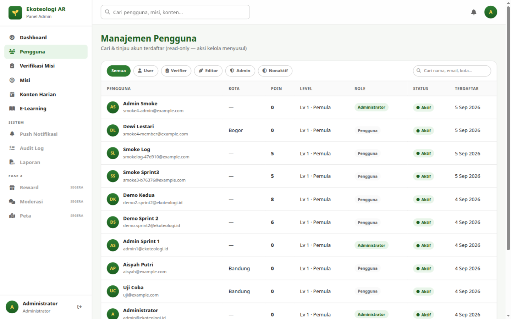

# Bab 4 — Manajemen Pengguna

## 4.1 Tujuan

Halaman ini untuk **mencari dan meninjau** akun pengguna aplikasi mobile yang
terdaftar. Saat ini halaman bersifat **read-only**: tidak ada tombol edit, blokir,
atau hapus — aksi kelola akun direncanakan menyusul. Untuk perubahan akun
(sekali waktu), lakukan dari sisi server.

**Cara akses:** menu **Pengguna** di sidebar.

## 4.2 Mencari & Memfilter

- **Chip filter** di kiri atas tabel: **Semua · User · Verifier · Editor · Admin ·
  Nonaktif**. Klik salah satu untuk memilah daftar; chip aktif ditandai warna hijau.
  *Nonaktif* menampilkan akun yang statusnya diblokir.
- **Kolom pencarian** di kanan atas tabel (*"Cari nama, email, kota…"*) — ketik
  sebagian nama, email, atau kota; hasil diperbarui otomatis sesaat setelah Anda
  berhenti mengetik.

## 4.3 Kolom Tabel

| Kolom | Isi |
|---|---|
| **Pengguna** | Avatar inisial + nama lengkap + email |
| **Kota** | Kota domisili pengguna (atau "—") |
| **Poin** | Total poin terkumpul |
| **Level** | Level & gelar, mis. `Lv 3 · Sahabat Bumi` (dihitung server dari poin) |
| **Role** | Peran akun: badge *Administrator / Verifier / Editor / Pengguna* |
| **Status** | Badge *Aktif* atau *Nonaktif* |
| **Terdaftar** | Tanggal akun dibuat, mis. `5 Sep 2026` |

## 4.4 Navigasi Halaman

Tabel menampilkan **20 pengguna per halaman**. Gunakan tombol panah ‹ › di kaki
tabel untuk berpindah; keterangan *"Menampilkan 1–20 dari N pengguna"* menunjukkan
posisi Anda. Bila filter/pencarian tidak menemukan apa pun, muncul
*"Tidak ada pengguna yang cocok dengan filter."*

## 4.5 Kapan Halaman Ini Dipakai?

- Mengonfirmasi klaim pengguna saat verifikasi bukti (cocokkan nama/kota di Bab 5).
- Menjawab tiket dukungan: "apakah akun saya sudah terdaftar?", "berapa poin saya?".
- Audit berkala: siapa saja yang berrole admin/verifier/editor saat ini.

Lanjut ke [Bab 5 — Verifikasi Misi](05-verifikasi-misi.md).
