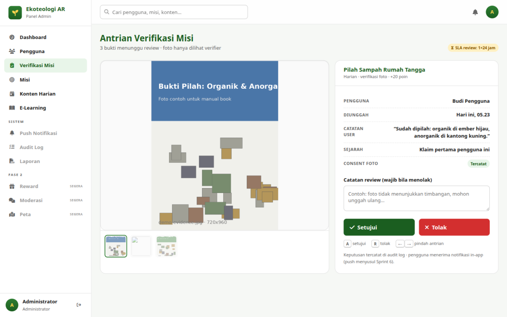

# Bab 5 — Verifikasi Misi

## 5.1 Tujuan

Halaman ini adalah **tugas harian paling penting**: memutuskan bukti foto misi
yang dikirim pengguna. Keputusan Anda menentukan apakah pengguna menerima poin.

> Yang diverifikasi di sini adalah **bukti foto misi** — bukan hasil scan AI
> (scan diproses otomatis, lihat Bab 1).

**Cara akses:** menu **Verifikasi Misi**. Halaman yang sama juga bisa dibuka dari
tombol **Buka Verifikasi** pada halaman **Misi** (Bab 6).

**Komitmen layanan (SLA):** setiap bukti direview maksimal **1×24 jam** — badge
SLA tampil di kanan atas halaman.

## 5.2 Memahami Antrian

Halaman terbagi dua panel:

- **Kiri** — pratinjau foto bukti yang sedang ditinjau, dengan **strip thumbnail**
  di bawahnya berisi seluruh antrian. Klik thumbnail untuk pindah item.
- **Kanan** — detail klaim:

| Elemen | Isi |
|---|---|
| Judul misi + sub-teks | Mis. *"Pilah Sampah Rumah Tangga — Harian · verifikasi foto · +20 poin"* |
| **Pengguna** | Nama dan kota pengirim |
| **Diunggah** | Waktu kirim, mis. *"Hari ini, 09.12"* / *"Kemarin, 21.40"* |
| **Catatan user** | Keterangan yang ditulis pengguna saat mengirim bukti (atau "—") |
| **Sejarah** | *"Klaim pertama pengguna ini"* atau *"Misi ke-N pengguna ini"* — bantu menilai pola |
| **Consent foto** | Badge *Tercatat / Tidak ada* — apakah pengguna memberi izin pemakaian foto |
| **Catatan review** | Kolom teks — **wajib diisi bila menolak** |

## 5.3 Memutuskan

1. Tinjau foto besar: apakah buktinya jelas, relevan dengan misi, dan tidak
   berindikasi palsu? Bandingkan dengan catatan user dan sejarah klaim.
2. Pilih salah satu:
   - **Setujui** (hijau) — poin langsung masuk ke pengguna, pengguna menerima
     notifikasi di aplikasi.
   - **Tolak** (merah) — **isi dulu kolom "Catatan review"** dengan alasan yang
     jelas dan santun, mis. *"foto tidak menunjukkan timbangan, mohon unggah
     ulang"*. Bila menolak tanpa catatan, panel menolak dengan pesan
     *"Tuliskan catatan alasan penolakan dulu, ya."*
3. Keputusan langsung terkirim (tanpa dialog konfirmasi tambahan) dan item keluar
   dari antrian. Pesan hasil:
   - Setujui: *"Disetujui: {nama} mendapat +N poin · tercatat di audit log."*
   - Tolak: *"Ditolak dengan catatan · {nama} dinotifikasikan."*

> **Tidak ada tombol "urungkan"** — keputusan final. Bila keliru, hubungi tim
> backend untuk koreksi manual.

## 5.4 Pintasan Keyboard

Untuk mempercepat saat antrian panjang:

| Tombol | Aksi |
|---|---|
| `A` | Setujui item aktif |
| `R` | Tolak item aktif (tetap wajib isi catatan dulu) |
| `←` / `→` | Pindah item antrian sebelumnya/berikutnya |

Pintasan diabaikan bila kursor sedang berada di kolom teks.

## 5.5 Kriteria Penilaian yang Disarankan

- Bukti memperlihatkan objek/aktivitas yang diminta misi (mis. misi setor plastik
  → foto sampah plastik di titik setor/timbangan).
- Foto terang, tidak blur berat, tidak tampak diambil dari internet.
- Catatan user masuk akal dan konsisten dengan foto.
- Klaim berulang dengan foto identik → layak ditolak dengan catatan penjelasan.
- Ragu-ragu → gunakan prinsip memberi manfaat pada pengguna baru, namun jangan
  ragu menolak bila bukti jelas tidak memenuhi.

Bila antrian habis, halaman menampilkan *"Antrian selesai! Tidak ada bukti yang
menunggu verifikasi. Kerja bagus!"* — muat ulang nanti untuk antrian baru.

**Hak akses:** hanya **Administrator** dan **Verifier** yang tombol
Setujui/Tolaknya aktif. Editor hanya dapat melihat antrian.

Lanjut ke [Bab 6 — Manajemen Misi](06-misi.md).
