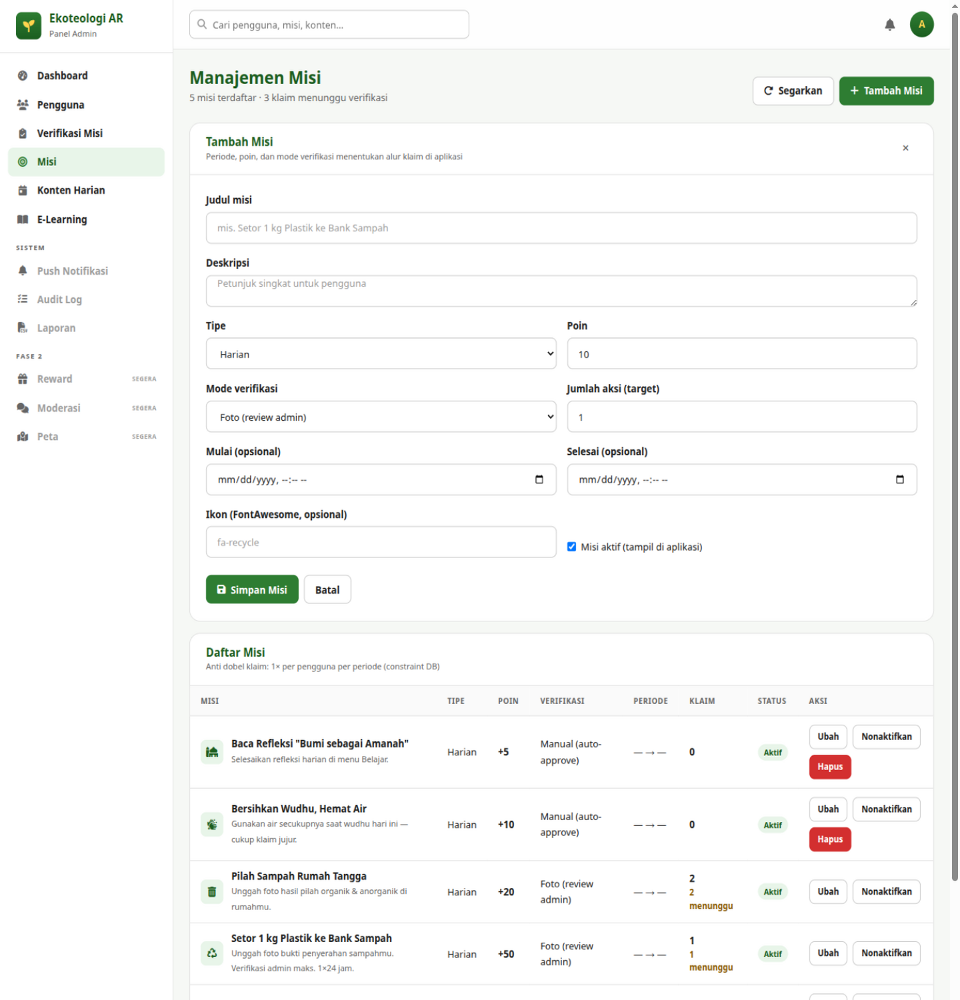
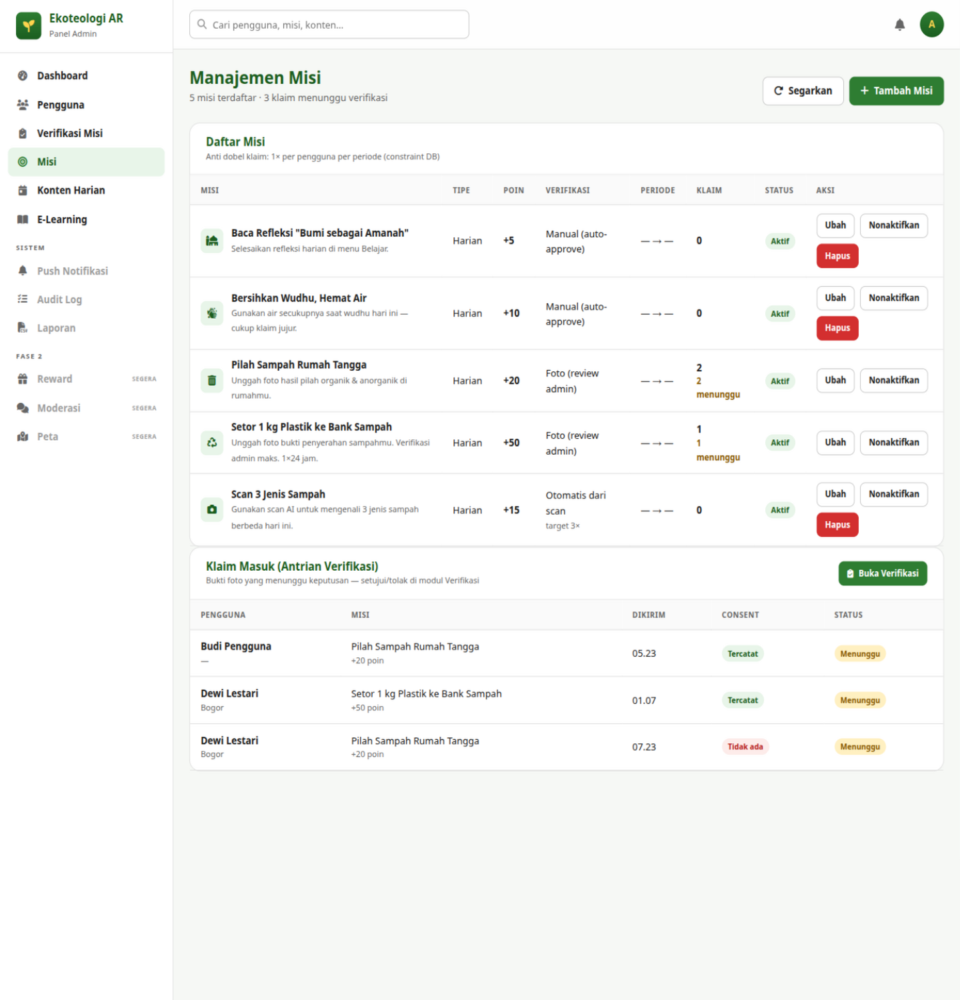

# Bab 6 — Manajemen Misi

## 6.1 Tujuan

Misi adalah aktivitas yang diikuti pengguna di aplikasi untuk mendapat poin.
Halaman ini untuk membuat, mengubah, menonaktifkan, dan menghapus misi — serta
memantau klaim yang masuk.

**Cara akses:** menu **Misi** di sidebar.

## 6.2 Membuat Misi Baru

1. Klik tombol **+ Tambah Misi** (kanan atas). Form **"Tambah Misi"** terbuka
   di atas daftar.
2. Isi field berikut:

| Field | Aturan | Keterangan |
|---|---|---|
| **Judul misi** | Wajib, maks. 150 karakter | Mis. *"Setor 1 kg Plastik ke Bank Sampah"* |
| **Deskripsi** | Opsional | Petunjuk singkat untuk pengguna |
| **Tipe** | Pilihan | **Harian** (reset tiap hari), **Mingguan**, atau **Spesial** (berjendela waktu) |
| **Poin** | Wajib, 1–10000, default 10 | Hadiah poin bila misi selesai |
| **Mode verifikasi** | Pilihan | Lihat penjelasan di bawah |
| **Jumlah aksi (target)** | 1–1000, default 1 | Berapa kali aksi harus dilakukan, mis. "scan 3 jenis sampah" |
| **Mulai / Selesai (opsional)** | Tanggal-jam | Jendela waktu misi (penting untuk tipe Spesial); mulai harus sebelum selesai |
| **Ikon (FontAwesome, opsional)** | Teks | Nama ikon, mis. `fa-recycle` |
| **Misi aktif (tampil di aplikasi)** | Centang | Kosongkan untuk menyimpan sebagai draf nonaktif |

3. Klik **Simpan Misi**. Toast *"Misi baru dibuat."* mengonfirmasi keberhasilan.
   Klik **Batal** untuk menutup form tanpa menyimpan.

### Memilih Mode Verifikasi

| Mode | Alur | Kapan dipakai |
|---|---|---|
| **Foto (review admin)** | Pengguna unggah foto → masuk antrian Bab 5 → Anda memutuskan | Misi yang butuh pembuktian manusia (setor bank sampah, pilah rumah) |
| **Otomatis dari scan** | Server menghitung otomatis dari aktivitas scan pengguna | Misi berbasis scan, mis. *"Scan 3 Jenis Sampah"* |
| **Manual (auto-approve)** | Klaim pengguna langsung selesai tanpa bukti | Misi kejujuran, mis. *"Bersihkan Wudhu, Hemat Air"* |

## 6.3 Daftar Misi

Kolom tabel: **Misi** (ikon + judul + deskripsi), **Tipe**, **Poin**, **Verifikasi**
(mode + sub-teks target), **Periode**, **Klaim** (total klaim + angka kuning yang
menunggu verifikasi), **Status**, dan **Aksi**. Sub-teks daftar mengingatkan aturan
anti-dobel: *1× klaim per pengguna per periode* (dijaga database).

Aksi per baris:

- **Ubah** — membuka form yang sama dengan data terisi; simpan dengan **Simpan Misi**.
- **Nonaktifkan / Aktifkan** — menyembunyikan misi dari aplikasi tanpa menghapus
  riwayatnya. Gunakan ini untuk misi musiman yang sudah berlalu.
- **Hapus** (hanya Administrator, hanya untuk misi yang **belum pernah diklaim**) —
  muncul dialog konfirmasi browser; setelah dihapus tidak bisa dikembalikan.
  Misi yang sudah punya klaim **tidak bisa dihapus** — nonaktifkan saja.

## 6.4 Panel Klaim Masuk

Di bawah daftar ada panel **"Klaim Masuk (Antrian Verifikasi)"** berisi hingga 8
bukti yang menunggu keputusan (hanya-baca). Klik **Buka Verifikasi** untuk
membuka antrian lengkap dan memutuskan — lihat Bab 5.

## 6.5 Pesan yang Akan Anda Temui

| Toast | Arti |
|---|---|
| *"Misi baru dibuat."* / *"Perubahan misi tersimpan."* | Sukses simpan |
| *"Misi \"X\" dinonaktifkan."* / *"diaktifkan."* / *"dihapus."* | Sukses aksi baris |
| *"Judul minimal 3 karakter."* / *"Poin minimal 1."* | Validasi form belum terpenuhi |
| *"Waktu mulai harus sebelum waktu selesai."* | Perbaiki jendela waktu |

Lanjut ke [Bab 7 — Konten Harian](07-konten-harian.md).
