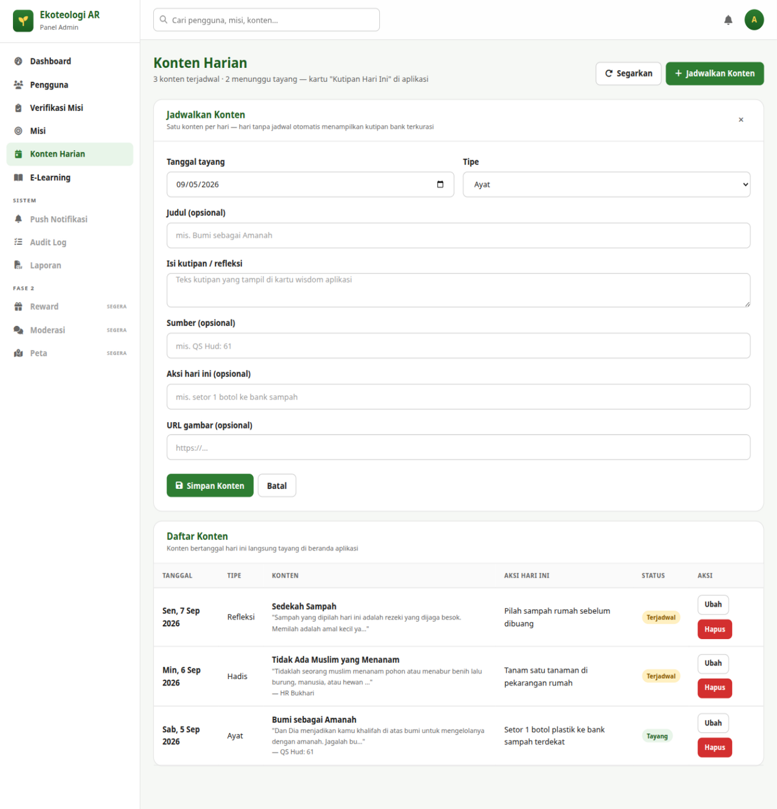
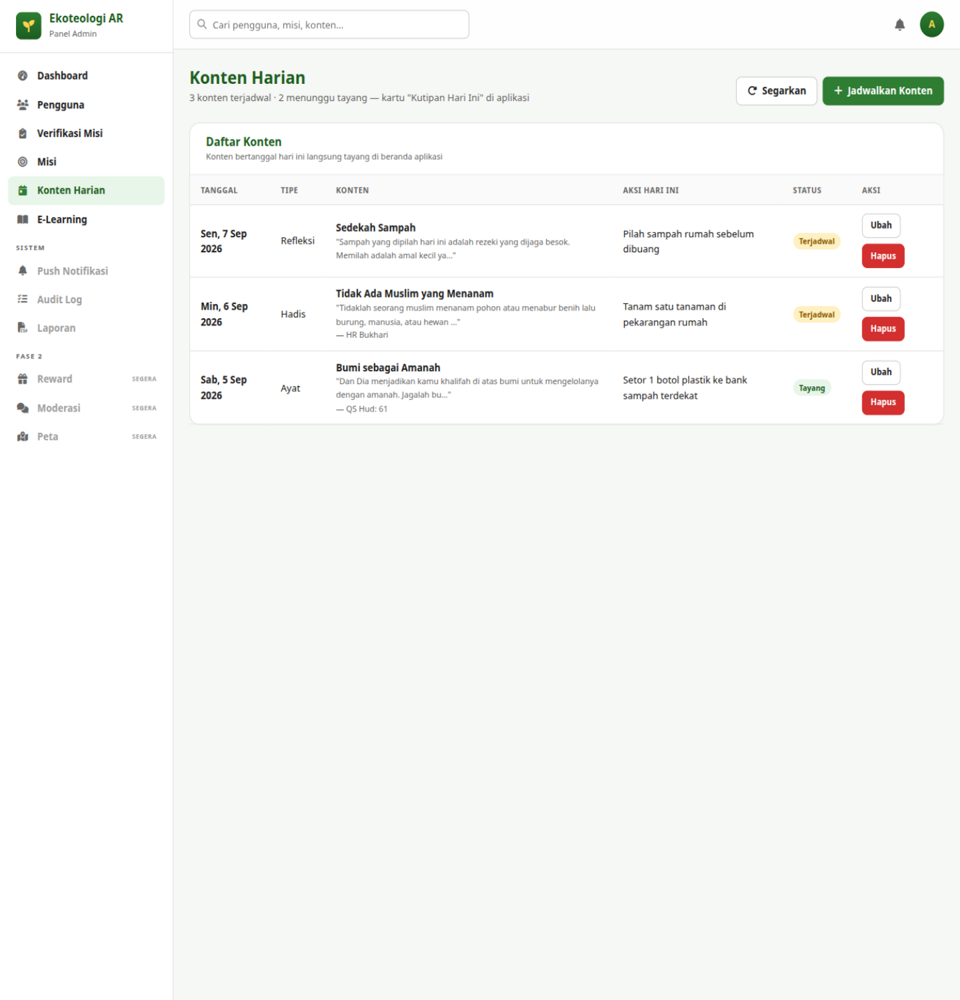

# Bab 7 — Konten Harian

## 7.1 Tujuan

Mengisi kartu **"Kutipan Hari Ini"** di beranda aplikasi pengguna: ayat, hadis,
atau refleksi bertema lingkungan, lengkap dengan saran aksi eco hari itu.

**Cara akses:** menu **Konten Harian** di sidebar.

## 7.2 Aturan Utama: Satu Konten per Tanggal

Setiap tanggal hanya memuat **satu** konten. Bila suatu tanggal tidak dijadwalkan,
aplikasi otomatis menampilkan kutipan dari bank terkurasi server — jadi aplikasi
**tidak pernah kosong**, dan tugas Anda adalah memastikan hari-hari penting punya
konten pilihan sendiri. Bila Anda menyimpan konten untuk tanggal yang sudah terisi,
server akan menolak dan pesan error tampil di form.

## 7.3 Menjadwalkan Konten

1. Klik **+ Jadwalkan Konten** (kanan atas).
2. Isi form **"Jadwalkan Konten"**:

| Field | Aturan | Keterangan |
|---|---|---|
| **Tanggal tayang** | Wajib | Default hari ini; konten bertanggal hari ini langsung tayang |
| **Tipe** | **Ayat / Hadis / Refleksi** | Menentukan gaya kartu di aplikasi |
| **Judul (opsional)** | Maks. 200 | Mis. *"Bumi sebagai Amanah"* |
| **Isi kutipan / refleksi** | Wajib, maks. 5000 | Teks utama yang tampil di kartu wisdom |
| **Sumber (opsional)** | Maks. 100 | Mis. *"QS Hud: 61"* atau *"HR Bukhari"* |
| **Aksi hari ini (opsional)** | Maks. 500 | Saran eco-action, mis. *"setor 1 botol ke bank sampah"* |
| **URL gambar (opsional)** | Maks. 1000 | Tautan gambar ilustrasi (opsional) |

3. Klik **Simpan Konten** — toast *"Konten harian dijadwalkan."*
   Klik **Batal** untuk menutup tanpa menyimpan.

## 7.4 Daftar Konten

Tabel **"Daftar Konten"** menampilkan semua jadwal dengan kolom: **Tanggal**,
**Tipe**, **Konten** (judul + potongan isi + sumber), **Aksi Hari Ini**,
**Status**, dan **Aksi**.

Status mengikuti tanggal:

- **Tayang** — tanggal sudah tiba (atau lewat); tampil di aplikasi.
- **Terjadwal** — tanggal masih di masa depan.

Aksi per baris: **Ubah** (Administrator/Editor) dan **Hapus** (hanya Administrator,
dengan dialog konfirmasi browser). Toast hapus: *"Konten harian dihapus."*

## 7.5 Tips Menyusun Konten

- Siapkan jadwal setidaknya **1 minggu ke depan** agar kolom *menunggu tayang*
  di sub-teks halaman tetap terisi.
- Kombinasikan tipe: ayat/hadis untuk hari kerja, refleksi + aksi konkret untuk
  akhir pekan.
- Sinkronkan **Aksi hari ini** dengan misi yang aktif (Bab 6) agar pengguna punya
  langkah lanjutan yang jelas.

Lanjut ke [Bab 8 — E-Learning](08-e-learning.md).
