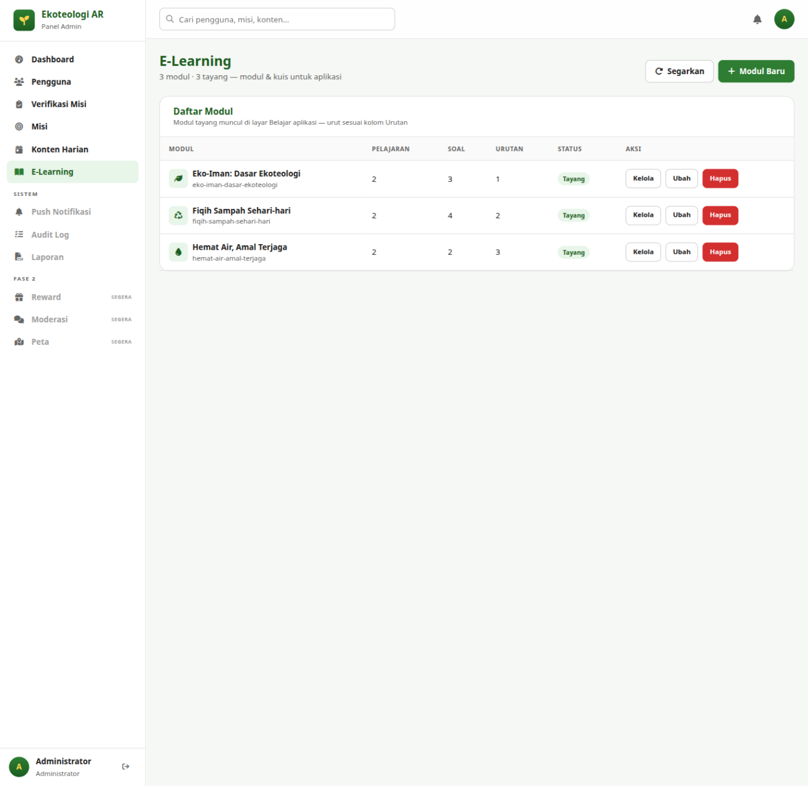
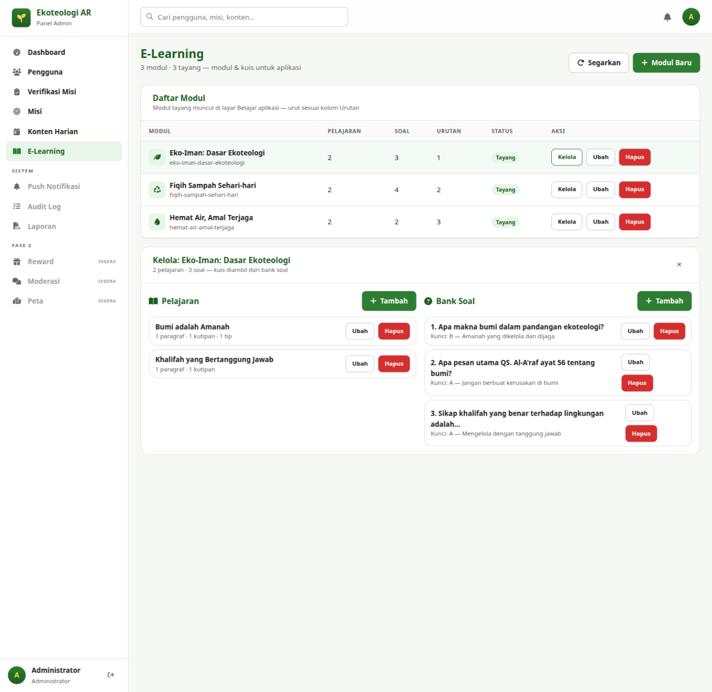
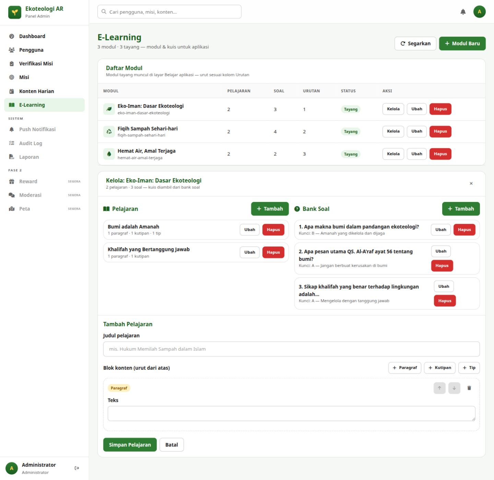
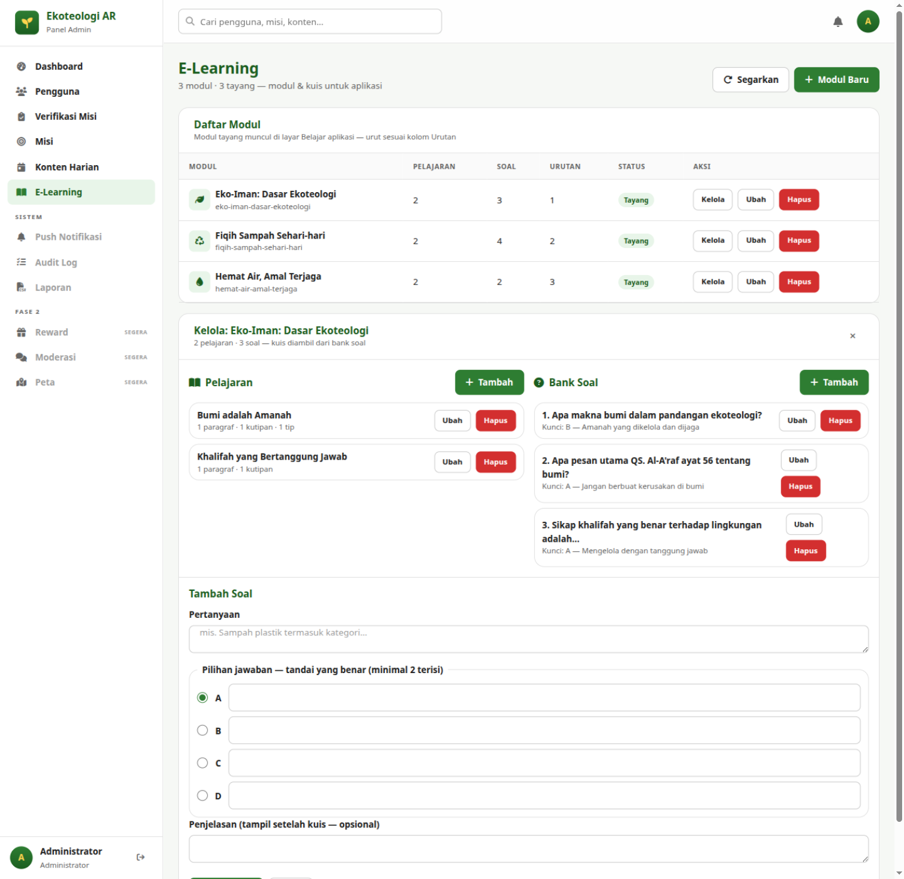

# Bab 8 — E-Learning

## 8.1 Tujuan

Menyiapkan materi belajar di aplikasi: **modul** → **pelajaran** (isi materi) →
**kuis** (dari bank soal). Pengguna membaca pelajaran, lulus kuis, dan mendapat
poin. Alur kerja yang disarankan: buat modul → tambah pelajaran → isi bank soal →
tayangkan modul.

**Cara akses:** menu **E-Learning** di sidebar.

## 8.2 Modul

### Membuat Modul

Klik **+ Modul Baru**, isi form, lalu **Simpan Modul**.

| Field | Aturan | Keterangan |
|---|---|---|
| **Judul modul** | Wajib, maks. 200 | Mis. *"Fiqih Sampah Sehari-hari"* |
| **Slug (opsional)** | Maks. 200 | Identifier URL; otomatis dari judul bila dikosongkan — pratinjau slug tampil langsung di bawah kolom judul |
| **Deskripsi** | Maks. 2000 | Ringkasan materi |
| **Ikon / cover** | Maks. 1000 | Nama ikon FontAwesome (mis. `fa-leaf`) atau URL gambar |
| **Urutan** | Angka ≥ 0 | Posisi modul di layar Belajar aplikasi |
| **Tayangkan modul ini di aplikasi** | Centang | Centang hanya setelah materi & soal siap |

### Daftar Modul

Kolom: **Modul** (ikon + judul + slug), **Pelajaran** (jumlah), **Soal** (jumlah),
**Urutan**, **Status** (*Tayang/Draft*), **Aksi**: **Kelola · Ubah · Hapus**.

- **Ubah** — form yang sama dengan data terisi.
- **Hapus** (hanya Administrator) — ditolak server bila modul sudah punya progres
  pengguna; nonaktifkan lewat *Ubah* bila itu terjadi.

## 8.3 Mengelola Pelajaran & Bank Soal

Klik **Kelola** pada sebuah modul — panel **"Kelola: {judul modul}"** terbuka
dengan dua kolom berdampingan:

### 8.3.1 Pelajaran (kolom kiri)

Setiap pelajaran tampil bernomor dengan ringkasan blok (mis. *"1 paragraf ·
1 kutipan · 1 tip"*). Klik **Tambah** untuk menulis pelajaran baru:

1. Isi **Judul pelajaran** (wajib, maks. 200).
2. Susun isi di **"Blok konten (urut dari atas)"** — klik salah satu tombol
   **+ Paragraf / + Kutipan / + Tip** untuk menambah blok:
   - **Paragraf** — satu kolom **Teks** (wajib, maks. 5000).
   - **Kutipan** — tiga kolom: **Teks Arab (opsional)** (ditulis kanan-ke-kiri),
     **Terjemah / isi kutipan** (wajib), **Sumber (opsional)**.
   - **Tip** — satu kolom **Teks** (wajib); gunakan untuk praktik singkat.
3. Atur urutan blok dengan tombol panah naik/turun di kartu blok; hapus blok
   dengan ikon tempat sampah.
4. Klik **Simpan Pelajaran**. Validasi yang mungkin muncul:
   *"Isi minimal satu blok konten."* / *"Ada blok kutipan tanpa teks — isi atau
   hapus bloknya."*

Aksi pada tiap pelajaran di daftar: **Ubah** dan **Hapus** (konfirmasi browser).

### 8.3.2 Bank Soal (kolom kanan)

Kuis modul **otomatis dibuat** begitu soal pertama ditambahkan; tidak ada
konfigurasi kuis terpisah. Poin hadiah kuis diatur server. Klik **Tambah**
di kolom Bank Soal:

1. Isi **Pertanyaan** (wajib, maks. 2000).
2. Isi **pilihan jawaban A–D** — minimal **dua pilihan terisi**. Tandai pilihan
   benar dengan memilih tombol radio di hurufnya.
3. **Penjelasan (opsional)** — tampil di aplikasi setelah pengguna menjawab;
   sangat disarankan untuk nilai edukatif.
4. Klik **Simpan Soal**. Validasi yang mungkin muncul:
   *"Isi minimal dua pilihan jawaban."* / *"Kunci jawaban harus salah satu
   pilihan yang terisi."*

Soal di daftar menampilkan kuncinya (mis. *"Kunci: B — Amanah yang dikelola dan
dijaga"*). Aksi: **Ubah** dan **Hapus** (konfirmasi browser).

## 8.4 Checklist Sebelum Menayangkan Modul

- [ ] Minimal 1 pelajaran dengan isi lengkap (tanpa blok kosong).
- [ ] Minimal beberapa soal dengan kunci jawaban benar dan penjelasan.
- [ ] Deskripsi & ikon terisi agar menarik di layar Belajar.
- [ ] Centang **Tayangkan modul ini di aplikasi** lalu simpan.

**Hak akses:** Administrator & Editor dapat menulis; **hapus hanya
Administrator**.

Lanjut ke [Bab 9 — Push Notifikasi](09-push-notifikasi.md).
