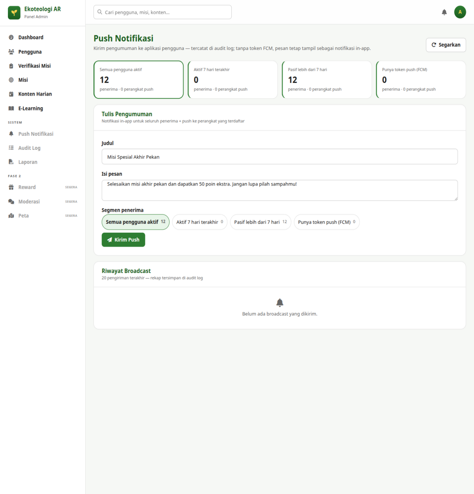

# Bab 9 — Push Notifikasi

## 9.1 Tujuan

Mengirim pengumuman broadcast ke aplikasi pengguna — misalnya peluncuran misi
spesial, pengumuman program, atau pengingat. Pesan tampil sebagai notifikasi
in-app bagi seluruh penerima, dan sebagai push ke perangkat yang terdaftar FCM.

> **Hanya Administrator** yang dapat membuka composer pengiriman. Verifier/editor
> melihat panel gembok *"Hanya role Admin yang dapat mengirim push"*.

**Cara akses:** menu **Push Notifikasi** (grup SISTEM), atau ikon lonceng di bar atas.

## 9.2 Memahami Segmen Penerima

Empat kartu di atas halaman menampilkan perkiraan penerima tiap segmen:

| Segmen | Siapa yang menerima |
|---|---|
| **Semua pengguna aktif** | Seluruh akun aktif (paling luas) |
| **Aktif 7 hari terakhir** | Pengguna yang beraktivitas dalam 7 hari |
| **Pasif lebih dari 7 hari** | Pengguna tidak aktif > 7 hari — cocok untuk pesan *win-back* |
| **Punya token push (FCM)** | Hanya yang perangkatnya terdaftar push (paling sempit) |

Angka kartu dan jumlah perangkat diperbarui saat halaman dibuka / tombol
**Segarkan** diklik.

## 9.3 Mengirim Pengumuman

Di kartu **"Tulis Pengumuman"**:

1. **Judul** — wajib, 4–64 karakter. Contoh: *"Misi Spesial Akhir Pekan"*.
2. **Isi pesan** — wajib, 8–300 karakter, satu kalimat sampai dua kalimat yang
   langsung dimengerti. Contoh: *"Selesaikan misi akhir pekan dan dapatkan 50
   poin ekstra."*
3. Pilih **Segmen penerima** dengan mengklik salah satu chip (terpilih = berwarna).
4. Klik **Kirim Push**.

Sebelum terkirim muncul dialog konfirmasi browser:
*"Kirim push ke N penerima · M perangkat? Tindakan ini tercatat di audit log."*
Periksa angkanya — kirim tidak bisa dibatalkan.

Setelah terkirim, panel hijau menampilkan ringkasan
*"Terkirim ke N dari M perangkat (K penerima)."*

## 9.4 Riwayat Broadcast

Tabel **"Riwayat Broadcast"** menyimpan **20 pengiriman terakhir**: **Waktu**,
**Pesan** (judul + isi), **Segmen**, **Penerima**, **Perangkat**, dan status
**Terkirim**. Rekap lengkap tersimpan di audit log di sisi server.

## 9.5 Etika Pengiriman

- Gunakan untuk pengumuman yang benar-benar bernilai; jangan rutin harian.
- Judul informatif tanpa huruf kapital berlebihan.
- Kirim pada jam wajar (08.00–20.00 waktu pengguna).
- Pesan pasif > 7 hari sebaiknya bernada mengajak, bukan menekan.

Lanjut ke [Bab 10 — Pemecahan Masalah](10-pemecahan-masalah.md).
